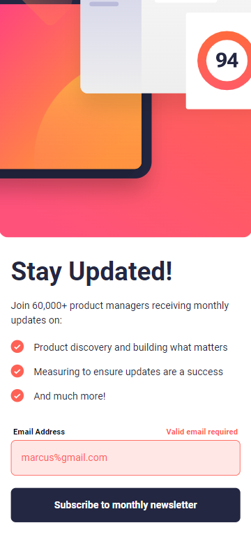
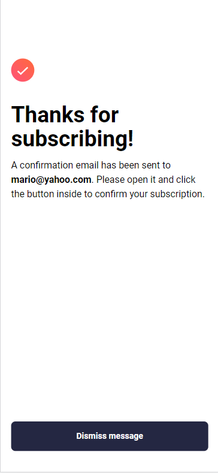

# Frontend Mentor - Newsletter sign-up form with success message solution

This is a solution to the [Newsletter sign-up form with success message challenge on Frontend Mentor](https://www.frontendmentor.io/challenges/newsletter-signup-form-with-success-message-3FC1AZbNrv). Frontend Mentor challenges help you improve your coding skills by building realistic projects. 

## Table of contents

- [Overview](#overview)
  - [The challenge](#the-challenge)
  - [Screenshot](#screenshot)
  - [Links](#links)
- [My process](#my-process)
  - [Built with](#built-with)
  - [What I learned](#what-i-learned)
  - [Continued development](#continued-development)
  - [Useful resources](#useful-resources)
- [Author](#author)

## Overview

### The challenge

Users should be able to:

- Add their email and submit the form
- See a success message with their email after successfully submitting the form
- See form validation messages if:
  - The field is left empty
  - The email address is not formatted correctly
- View the optimal layout for the interface depending on their device's screen size
- See hover and focus states for all interactive elements on the page

### Screenshot

### Links

- Solution URL: [Add solution URL here](https://github.com/OmarIsmail7980/newsletter-signup-form)
- Live Site URL: [Add live site URL here](https://newsletter-sub.netlify.app)

## My process

### Built with

- Semantic HTML5 markup
- Flexbox
- Responsive workflow
- [React](https://reactjs.org/) - JS library
- Tailwind CSS

### What I learned

In this challenge I learned how to utilize Tailwind css to create responsive layout that looks very beautiful and agrees with design document. I also made sure the application is accessable by using Semantic HTML5 instead of Divs

### Continued development

An area I will try to improve on is styling images.

### Useful resources

- [Taiwind css docs](https://tailwindcss.com/docs) - This helped pick the right utility class that fit my need

## Author

- Website - [Omar Ismail](https://omarismail7980.github.io/Portfolio/)
- Frontend Mentor - [@OmarIsmail7980](https://www.frontendmentor.io/profile/OmarIsmail7980)

